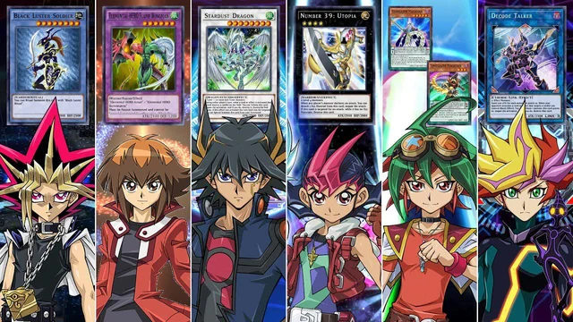

# Reto de Programación: Juego de Cartas con API YGOProDeck

¡Bienvenido al reto de programación! En este desafío, vas a construir un emocionante juego de cartas utilizando la [API YGOProDeck](https://ygoprodeck.com/api-guide/). Tu objetivo será crear un juego de cartas 1 contra 1 donde te enfrentarás a un oponente controlado por una función aleatoria.

## Descripción del Reto

**Juego de Cartas 1 contra 1**  
Tu tarea es desarrollar un juego de cartas en el que el jugador humano compita contra un oponente controlado por una función de IA simple. El oponente tomará decisiones al azar, lo que permitirá que el juego sea desafiante pero impredecible.

### Funcionalidades Clave

1. **Integración con la API YGOProDeck**  
   Utiliza la API de YGOProDeck para obtener información sobre las cartas, construir mazos y realizar otras acciones necesarias para el juego. La API proporciona datos sobre cartas, mazos y más, facilitando la creación y gestión de las cartas en el juego.

2. **Juego 1 contra 1**  
   El juego debe permitir a un jugador humano enfrentarse a un oponente controlado por el sistema. El jugador debe tener la capacidad de tomar decisiones estratégicas, mientras que el oponente tomará decisiones al azar.

3. **Oponente Aleatorio**  
   Implementa una función que actúe como el oponente y tome decisiones aleatorias durante el juego. Esta función debe seleccionar cartas y realizar movimientos de manera que simule un oponente humano básico.

### Requisitos

- **Interfaz de Usuario**  
  Desarrolla una interfaz de usuario que permita al jugador ver su mano, el mazo del oponente y el estado actual del juego. Puedes optar por una interfaz gráfica o basada en texto.

- **Gestión de Cartas**  
  Utiliza la API YGOProDeck para gestionar las cartas del juego. Esto incluye obtener información sobre cartas, añadir cartas al mazo y realizar jugadas durante el juego.

- **Reglas del Juego**  
  Asegúrate de que el juego siga las reglas básicas de un juego de cartas típico. Puedes basarte en un juego de cartas existente o diseñar tus propias reglas, siempre que sean claras y se puedan seguir durante la partida.

- **Funcionalidad Aleatoria**  
  La IA del oponente debe ser lo suficientemente básica para que tome decisiones aleatorias, pero también debe seguir las reglas del juego y hacer movimientos válidos.

### Recursos

- **[API YGOProDeck](https://ygoprodeck.com/api-guide/)**  
  Consulta la documentación de la API para conocer los endpoints disponibles y cómo utilizarlos para obtener información sobre cartas y mazos.

- **Ejemplos de Código**  
  Revisa ejemplos de cómo interactuar con la API y cómo gestionar las cartas en un juego de cartas para obtener una mejor comprensión de cómo implementar las funcionalidades requeridas.

### Entrega

Tu implementación debe incluir:

- Código fuente completo del juego.
- Instrucciones claras sobre cómo ejecutar el juego.
- Un archivo README con detalles sobre cómo se ha implementado el juego y cualquier otra información relevante.

¡Diviértete desarrollando tu juego de cartas y demuestra tus habilidades de programación! Si tienes alguna pregunta o necesitas ayuda, no dudes en pedirla. ¡Buena suerte!
