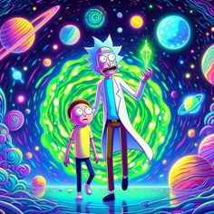

```markdown
# Tarea de Desarrollo: Creación de una Aplicación de Tarjetas de Personajes


## Objetivo
Desarrollar una aplicación sencilla que recoja datos de personajes desde una API externa y los muestre en formato de tarjetas estilo juego. Este proyecto está diseñado para que un desarrollador principiante lo complete en aproximadamente 1-2 horas.

## Requisitos de Desarrollo

1. **Lenguaje de Programación**:
   - Puedes usar cualquier lenguaje de programación con el que te sientas cómodo, como JavaScript, Python, Java, etc.

2. **Uso de API Externa**:
   - Utiliza la API de Rick and Morty para obtener datos de los personajes: `https://rickandmortyapi.com/api/character`
   - Debes hacer una solicitud GET a esta API para obtener una lista de personajes.

3. **Interfaz de Usuario**:
   - Crea una interfaz simple que muestre los personajes en tarjetas.
   - Cada tarjeta debe incluir al menos: nombre del personaje, imagen, especie y estado (vivo, muerto o desconocido).

4. **Diseño y Estilo**:
   - Las tarjetas deben estar organizadas en una cuadrícula.
   - Usa CSS (o el equivalente en tu lenguaje) para darle estilo a las tarjetas.
   - Las tarjetas deben ser responsive y ajustarse al tamaño de la pantalla.

5. **Funcionalidades Específicas**:
   - Al cargar la aplicación, se deben mostrar al menos 10 personajes.
   - Incluir un botón para cargar más personajes (opcional).

## Normas de Desarrollo

1. **Estructura del Proyecto**:
   - Organiza tu proyecto de manera clara y lógica.
   - Incluye una carpeta para los estilos (CSS), una para el código fuente (JS, Python, etc.) y otra para los recursos (imágenes, etc.), si es necesario.

2. **Documentación**:
   - Añade comentarios en el código para explicar las partes clave del desarrollo.
   - Incluye un archivo README.md con instrucciones sobre cómo ejecutar la aplicación.

3. **Buenas Prácticas**:
   - Sigue las mejores prácticas de codificación para el lenguaje elegido.
   - Asegúrate de que tu código sea legible y esté bien estructurado.

## Pasos para Desarrollar la Aplicación

1. **Configurar el Entorno de Desarrollo**:
   - Configura tu entorno de desarrollo según el lenguaje que hayas elegido.
   - Instala las dependencias necesarias (por ejemplo, axios para JavaScript, requests para Python).

2. **Hacer la Solicitud a la API**:
   - Realiza una solicitud GET a la API de Rick and Morty para obtener los datos de los personajes.
   - Maneja la respuesta y extrae los datos necesarios (nombre, imagen, especie, estado).

3. **Diseñar la Interfaz de Usuario**:
   - Crea el HTML/CSS para la estructura y el diseño de las tarjetas.
   - Asegúrate de que las tarjetas se vean bien en diferentes tamaños de pantalla.

4. **Mostrar los Datos en las Tarjetas**:
   - Usa JavaScript o el lenguaje elegido para insertar los datos de los personajes en las tarjetas.
   - Implementa la funcionalidad para cargar más personajes si decides incluirla.

5. **Pruebas y Depuración**:
   - Prueba la aplicación en diferentes navegadores y dispositivos.
   - Corrige cualquier error o problema de estilo que encuentres.

6. **Documentación y Entrega**:
   - Escribe la documentación necesaria.
   - Asegúrate de que el proyecto esté completo y organizado antes de entregarlo.

## Recursos

- [API de Rick and Morty](https://rickandmortyapi.com/documentation)
- [Documentación de Axios](https://axios-http.com/docs/intro) (si usas JavaScript)
- [Documentación de Requests](https://docs.python-requests.org/en/latest/) (si usas Python)

¡Buena suerte y disfruta del proceso de desarrollo!
```

